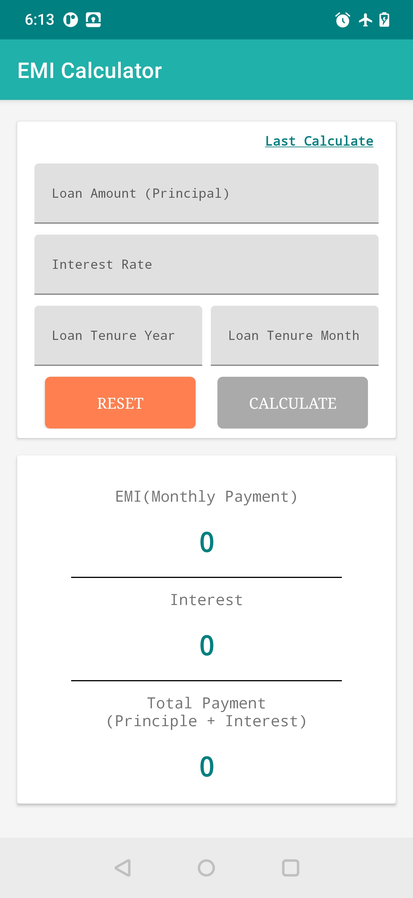
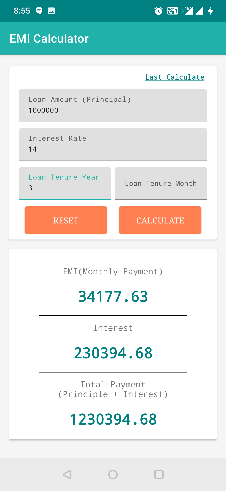

# Emi Calculator App

Emi Calculator is a simple loan calculation tool that helps the user to quickly calculate EMI.
 

### Features
---
- Loan emi calculate
- Get last calculate record

### Application Architecture
---
- IDE: Android Studio
- Programming Language: Kotlin
- Architecture: MVVM
- Third Party Libraries: Coroutines, Flow, DaggerHilt, DataStore, Splashscreen, Firebase

 

## 🚀 Learning Tips:
 Main Purpose to create project to understand how to use Flow with DaggerHilt & DataStore using MVVM architecture design pattern.

 Let’s get understand.

 Why we use flow?
 A suspending function asynchronously returns a single value, but how can we return multiple asynchronously computed values?
 This is where Kotlin Flows come in.A flow is a type that can emit multiple values sequentially as opposed to suspend functions
 that return only a single value.

 Hot & Cold Flow:
 Flow can be either hot or cold. Hot flow send or emit data even if no one is watching them and cold flow emit
 data only if they have an active observer. By default, Kotlin flows are cold.

 StateFlow and LiveData:
 StateFlow and LiveData have similarities. Both are observable data holder classes, and both follow a similar pattern when used in your app architecture.

 Note, however, that StateFlow and LiveData do behave differently:
  - StateFlow requires an initial state to be passed in to the constructor, while LiveData does not.
  - LiveData.observe() automatically unregisters the consumer when the view goes to the STOPPED state, whereas collecting from a StateFlow or any other flow does not stop collecting automatically. To achieve the same behavior,you need to collect the flow from a Lifecycle.repeatOnLifecycle block.

 StateFlow and SharedFlow:
 Both are the hot flow, and main difference between is that a StateFlow takes a default value through the constructor and emits it immediately when someone starts collecting, while a SharedFlow takes no value and emits nothing by default.
 we can use state flow where we don't want to collect same value which is emitted by StateFlow but if you want to emitted same value so you can use SharedFlow.

 DataStore: Jetpack DataStore is a data storage solution that allows you to store key-value pairs or typed objects with protocol buffers. DataStore uses Kotlin coroutines and Flow to store data asynchronously, consistently, and transactionally. If you’re currently using SharedPreferences to store data, consider migrating to DataStore instead.

 Note: you can download the source and lookup the code so you can better understand, what is use case of Flow & DataStore.

## Screenshots
||||
|:----:|:----:|:----:|

## Demo

<h2>Emi EmiCalculator App</h2>

